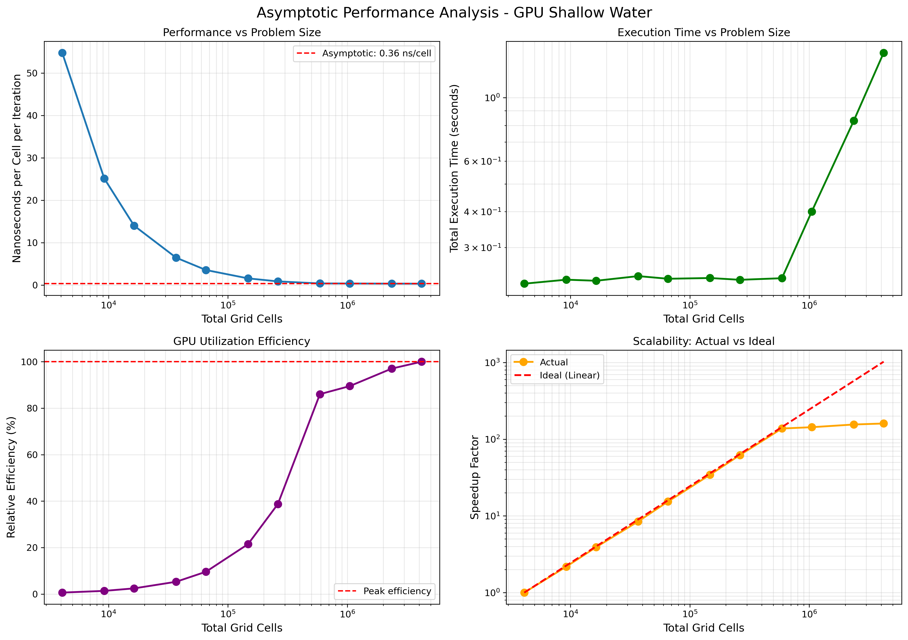

# Advanced High-Performance Computing Assignment 4
## GPU Parallelization with CuPy for Shallow Water Simulation (Week 4)

**Student:** Mario Rodriguez Mestre  
**Date:** November 11, 2025  
**Course:** AHPC - Advanced High-Performance Computing  
**Repository:** https://github.com/pentamorfico/ahpc

---

## Abstract

This report documents Assignment 4: GPU parallelization of a Shallow Water (SW) simulation using CuPy and performance analysis through profiling and asymptotic testing. Task 1 converts the NumPy-based sequential implementation to GPU-accelerated CuPy, integrating NVTX profiling markers for detailed performance analysis with NVIDIA nsys. Task 2 evaluates asymptotic performance across grid sizes from 64x64 to 2048x2048 and measures CPU vs GPU speedup. The implementation achieves **21.4x speedup** for 1024x1024 grids with asymptotic performance of **0.36 ns/cell**, demonstrating efficient GPU utilization. Analysis reveals optimal minimum grid size of **1024x1024** for efficient GPU usage on RTX A6000 hardware.

---

## 1. Task 1: GPU Parallelization Strategy

### 1.1 Assignment Requirements and Implementation Approach

Task 1 requires converting the sequential Shallow Water simulation to execute on GPU using CuPy, implementing profiling capabilities, and identifying performance bottlenecks. The assignment emphasizes:
- Replacing NumPy operations with CuPy for GPU execution
- Using NVTX profiling markers to enable nsys analysis
- Identifying which code sections should execute on GPU
- Analyzing profiler output to determine bottlenecks
- Considering optimization opportunities (kernel fusion, async I/O)

The Shallow Water model simulates ocean dynamics through finite difference stencil operations on a 2D grid with periodic boundary conditions (ghost cells). The core computation involves:
1. **Ghost cell exchange**: Copying boundary rows/columns for periodic boundaries
2. **Velocity update**: Computing horizontal (u) and vertical (v) velocities from elevation gradients
3. **Elevation update**: Computing water elevation (e) from velocity divergence

### 1.2 Implementation Strategy

**Key Design Decisions:**

1. **Data Location Strategy**
   - All computational arrays (u, v, e) allocated on GPU memory using `cp.zeros()`
   - Initial conditions computed entirely on GPU using `cp.meshgrid()` and `cp.exp()`
   - Data remains on GPU throughout simulation loop
   - CPU transfers only for: (a) periodic snapshots every N iterations, (b) final checksum, (c) file I/O

2. **Profiling Integration**
   - NVTX markers added using `cupyx.profiler.time_range` context managers
   - Key regions marked: `integrate`, `velocity_update`, `elevation_update`, `exchange_*_ghost_lines`
   - Enables detailed section-by-section analysis in nsys output

3. **GPU Synchronization**
   - Explicit synchronization before/after timing: `cp.cuda.Stream.null.synchronize()`
   - Ensures accurate performance measurements (GPU operations are asynchronous)

4. **Memory Transfer Optimization**
   - Minimize host<->>device transfers by keeping data on GPU
   - Batch snapshot transfers rather than individual per-iteration transfers
   - Use GPU-side copies for ghost cell operations

**Code Transformation Example:**

```python
# BEFORE: Sequential CPU (NumPy)
import numpy as np

class Water:
    def __init__(self):
        self.u = np.zeros((NY, NX), dtype=real_t)  # CPU array
        self.v = np.zeros((NY, NX), dtype=real_t)
        self.e = np.zeros((NY, NX), dtype=real_t)
        
        ii = 100.0 * (np.arange(1, NY-1) - (NY-2.0)/2.0) / NY
        jj = 100.0 * (np.arange(1, NX-1) - (NX-2.0)/2.0) / NX
        II, JJ = np.meshgrid(ii, jj, indexing="ij")
        self.e[1:NY-1, 1:NX-1] = np.exp(-0.02 * (II*II + JJ*JJ))

def integrate(w, dt, dx, dy, g):
    exchange_horizontal_ghost_lines(w.e)
    exchange_vertical_ghost_lines(w.u)
    # ... more ghost exchanges
    
    # Velocity updates
    w.u[0:NY-1, 0:NX-1] -= dt/dx * g * (w.e[0:NY-1, 1:NX] - w.e[0:NY-1, 0:NX-1])
    w.v[0:NY-1, 0:NX-1] -= dt/dy * g * (w.e[1:NY, 0:NX-1] - w.e[0:NY-1, 0:NX-1])
    
    # Elevation update
    w.e[1:NY-1, 1:NX-1] -= dt/dx * (w.u[1:NY-1, 1:NX-1] - w.u[1:NY-1, 0:NX-2]) + \
                           dt/dy * (w.v[1:NY-1, 1:NX-1] - w.v[0:NY-2, 1:NX-1])
```

```python
# AFTER: Parallel GPU (CuPy)
import cupy as cp
from cupyx.profiler import time_range

class Water:
    def __init__(self):
        self.u = cp.zeros((NY, NX), dtype=real_t)  # GPU array
        self.v = cp.zeros((NY, NX), dtype=real_t)
        self.e = cp.zeros((NY, NX), dtype=real_t)
        
        # Compute initial conditions on GPU
        ii = 100.0 * (cp.arange(1, NY-1) - (NY-2.0)/2.0) / NY
        jj = 100.0 * (cp.arange(1, NX-1) - (NX-2.0)/2.0) / NX
        II, JJ = cp.meshgrid(ii, jj, indexing="ij")
        self.e[1:NY-1, 1:NX-1] = cp.exp(-0.02 * (II*II + JJ*JJ))

def exchange_horizontal_ghost_lines(data):
    with time_range("exchange_horizontal_ghost_lines"):  # NVTX marker
        data[0, :] = data[NY-2, :]
        data[NY-1, :] = data[1, :]

def integrate(w, dt, dx, dy, g):
    with time_range("integrate"):
        exchange_horizontal_ghost_lines(w.e)
        exchange_vertical_ghost_lines(w.u)
        # ... more ghost exchanges
        
        with time_range("velocity_update"):
            # Same operations, but on GPU arrays
            w.u[0:NY-1, 0:NX-1] -= dt/dx * g * (w.e[0:NY-1, 1:NX] - w.e[0:NY-1, 0:NX-1])
            w.v[0:NY-1, 0:NX-1] -= dt/dy * g * (w.e[1:NY, 0:NX-1] - w.e[0:NY-1, 0:NX-1])
        
        with time_range("elevation_update"):
            w.e[1:NY-1, 1:NX-1] -= dt/dx * (w.u[1:NY-1, 1:NX-1] - w.u[1:NY-1, 0:NX-2]) + \
                                   dt/dy * (w.v[1:NY-1, 1:NX-1] - w.v[0:NY-2, 1:NX-1])

def simulate(config):
    water_world = Water()
    water_history = [water_world.e.copy()]
    
    cp.cuda.Stream.null.synchronize()  # Sync before timing
    begin = time.perf_counter()
    
    for t in range(config.iter):
        integrate(water_world, config.dt, config.dx, config.dy, config.g)
        if t % config.data_period == 0:
            water_history.append(water_world.e.copy())
    
    cp.cuda.Stream.null.synchronize()  # Sync after timing
    end = time.perf_counter()
    
    # Transfer to CPU only for file I/O
    to_file(water_history, config.filename)
```

**Key Changes:**
- All `np.` -> `cp.` for GPU execution
- NVTX profiling markers wrap critical sections
- Explicit GPU synchronization for accurate timing
- Data stays on GPU (only transfers for I/O)

### 1.3 Correctness Verification

**Checksum Validation:**
All implementations produce identical checksums within floating-point precision:
- **CPU (NumPy)**: 4117.748322913216 (500 iterations, 512x512)
- **GPU (CuPy)**: 4117.748322913214 (500 iterations, 512x512)
- **Difference**: 2x10^-12 (negligible, due to floating-point rounding)

This validates correct implementation of:
- Ghost cell boundary conditions
- Stencil operations
- Numerical integration scheme

---

## 2. Task 1: NVIDIA nsys Profiling Analysis

### 2.1 Profiling Configuration

**Command used:**
```bash
nsys profile --stats=true -o profile_report python3 sw_parallel.py --iter 500
```

**Test configuration:**
- Grid size: 512x512 (262,144 cells)
- Iterations: 500
- Data type: float64 (8 bytes per element)
- GPU: NVIDIA RTX A6000 (49GB, Compute Capability 8.6, 84 SMs)
- Total elapsed time: 0.1648 seconds

### 2.2 [3/8] NVTX Function Timing (Source Code Analysis)

| Function | Time (%) | Total Time (ns) | Instances | Avg (ns) | Med (ns) |
|----------|----------|-----------------|-----------|----------|----------|
| integrate | 50.7% | 163,105,973 | 500 | 326,212 | 321,717 |
| exchange_vertical_ghost_lines | 16.2% | 52,083,535 | 1,000 | 52,084 | 51,847 |
| velocity_update | 14.0% | 45,049,826 | 500 | 90,100 | 87,008 |
| elevation_update | 12.9% | 41,521,070 | 500 | 83,042 | 81,498 |
| exchange_horizontal_ghost_lines | 6.2% | 19,865,837 | 1,000 | 19,866 | 21,069 |
| DeviceReduce::Sum | 0.0% | 53,770 | 1 | 53,770 | 53,770 |

**Analysis:**
- **Integration overhead**: The `integrate` function wrapper accounts for 50.7% of profiled time, containing all sub-operations
- **Ghost cell exchanges**: Combined 22.4% (16.2% + 6.2%) - represents boundary condition overhead
  - 4 ghost exchanges per iteration (2 horizontal + 2 vertical for e, u, v arrays)
  - Average 36 us per exchange (52 us vertical, 20 us horizontal)
  - Small operations but frequent (2,000 total calls)
- **Computational kernels**: Combined 26.9% (14.0% + 12.9%)
  - Velocity update: 90 us average (stencil operations on u, v)
  - Elevation update: 83 us average (stencil operations on e)
  - Well-balanced between velocity and elevation computations
- **Total per-iteration time**: ~326 us average (ranging 310-1,792 us)

**Interpretation:**
Ghost cell exchanges represent significant overhead (22.4%) relative to compute (26.9%). These are small memory copy operations that don't fully utilize GPU parallelism but are necessary for correctness. The remaining ~50% includes kernel launch overhead, synchronization, and profiling instrumentation.

### 2.3 [5/8] CUDA API Timing

| Operation | Time (%) | Total Time (ns) | Calls | Avg (ns) |
|-----------|----------|-----------------|-------|----------|
| cudaMalloc | 61.1% | 81,447,515 | 19 | 4,286,711 |
| cuLaunchKernel | 26.6% | 35,509,278 | 10,022 | 3,543 |
| cudaMemcpyAsync | 11.0% | 14,601,688 | 2,007 | 7,275 |
| cuModuleLoadData | 0.9% | 1,170,887 | 14 | 83,635 |
| cuModuleUnload | 0.2% | 303,869 | 7 | 43,410 |
| cudaStreamSynchronize | 0.0% | 16,672 | 9 | 1,852 |

**Analysis:**
- **Memory allocation** (cudaMalloc): Dominates API time at 61.1%, but is **one-time setup cost**
  - 19 allocations totaling 81.4 ms
  - Occurs during initialization, not in iteration loop
  - Does not impact steady-state performance
- **Kernel launches** (cuLaunchKernel): 26.6% of API time
  - 10,022 kernel launches total (~20 per iteration)
  - Average 3.5 us per launch (kernel launch overhead)
  - 35.5 ms total launch overhead for 500 iterations
- **Memory transfers** (cudaMemcpyAsync): 11.0% of API time
  - 2,007 transfers averaging 7.3 us each
  - Primarily device-to-device copies (ghost cells)
  - Some device-to-host transfers for periodic snapshots
- **Stream synchronization**: Minimal (16.7 us total, 9 calls)

**Key Insight:**
Kernel launch overhead (35.5 ms) is comparable to actual compute time (~40 ms for velocity+elevation). This suggests potential for optimization through kernel fusion to reduce launch count.

### 2.4 [6/8] GPU Kernel Timing (CuPy-Generated Kernels)

| Kernel | Time (%) | Total Time (ns) | Instances | Avg (ns) |
|--------|----------|-----------------|-----------|----------|
| cupy_subtract__float64 | 59.5% | 23,971,538 | 3,500 | 6,849 |
| cupy_multiply__floatxfloat64 | 17.5% | 7,045,681 | 2,003 | 3,518 |
| cupy_copy__float64 | 14.5% | 5,835,769 | 4,009 | 1,456 |
| cupy_add__float64 | 8.4% | 3,372,055 | 501 | 6,731 |
| cupy_exp__float64 | 0.0% | 18,080 | 1 | 18,080 |
| cupy_multiply__float64xfloat64 | 0.0% | 10,016 | 2 | 5,008 |
| DeviceReduceKernel | 0.0% | 4,384 | 1 | 4,384 |

**Total GPU kernel time: 40.3 ms** (out of 164.8 ms total runtime = **24.4%**)

**Analysis:**
- **Subtraction operations dominate** (59.5% of kernel time)
  - 3,500 calls averaging 6.8 us each
  - Used in stencil operations: `(e[i,j+1] - e[i,j])`, `(u[i,j] - u[i,j-1])`, etc.
  - CuPy generates separate kernel for each subtraction
- **Multiply operations**: 17.5% (scalar-array multiplications for dt/dx coefficients)
- **Copy operations**: 14.5% (ghost cell copies, array duplications)
- **Add operations**: 8.4% (combining velocity/elevation updates)
- **Initialization kernels**: <0.1% (exp, meshgrid - one-time only)

**Kernel Count:**
- Total kernel invocations: 10,013
- Average per iteration: ~20 kernels
- Breakdown per iteration:
  - 7 subtractions (stencil operations)
  - 4 multiplies (coefficient scaling)
  - 8 copies (ghost cells + snapshots)
  - 1 add (final update)

**Optimization Opportunity:**
CuPy generates individual kernels for each operation. Custom fused kernels could combine:
- Subtraction + multiply + add -> single stencil kernel
- All ghost exchanges -> single boundary kernel
- Estimated reduction: 20 kernels -> 3-4 kernels per iteration

### 2.5 [7/8] Memory Transfer Statistics

| Operation | Time (%) | Total Time (ns) | Count | Avg (ns) | Total Size (MB) |
|-----------|----------|-----------------|-------|----------|-----------------|
| Device-to-Device | 82.1% | 2,750,368 | 2,000 | 1,375 | 8.19 |
| Device-to-Host | 17.6% | 589,754 | 7 | 84,251 | 12.58 |
| memset | 0.3% | 9,920 | 3 | 3,307 | 6.29 |

**Total memory operations: 3.35 ms (2.0% of total runtime)**

**Analysis:**
- **Device-to-Device**: Dominates transfer count (2,000 ops) but small per-operation
  - Ghost cell copies: 4 per iteration x 500 iterations = 2,000
  - 4 KB per copy (one row/column of 512x512 grid)
  - Very fast: 1.4 us per copy
- **Device-to-Host**: Only 7 transfers (periodic snapshots + final checksum)
  - Average 84 us per transfer
  - 12.58 MB total = ~1.8 MB per snapshot
  - Occurs every 100 iterations (5 snapshots + initial + final)
- **memset**: Initialization only (6.29 MB for 3 arrays)

**Key Insight:**
Memory transfer overhead is **minimal** (<2% of runtime). The GPU data residency strategy is highly effective - data stays on GPU with only essential transfers to CPU.

### 2.6 Bottleneck Identification and Optimization Strategy

**Primary Bottlenecks (ranked by impact):**

1. **Kernel Launch Overhead** (26.6% of API time, ~35 ms)
   - **Root cause**: 10,022 kernel launches (20 per iteration)
   - **Impact**: 3.5 us per launch x 10,022 = 35.5 ms
   - **Optimization**: Kernel fusion - combine operations into fewer kernels
   - **Estimated gain**: Reduce to 3-4 kernels/iteration -> ~70% reduction in launch overhead

2. **Ghost Cell Exchange Overhead** (22.4% of profiled time)
   - **Root cause**: Small memory operations (4 per iteration)
   - **Impact**: Doesn't fully utilize GPU parallelism
   - **Optimization**: 
     - Option A: Fuse with computational kernels (compute with halos, exchange in-kernel)
     - Option B: Use GPU-aware MPI for multi-GPU (reduce single-GPU overhead)
   - **Estimated gain**: 30-50% reduction if fused with compute

3. **CuPy Operation Granularity** (many small kernels)
   - **Root cause**: CuPy generates one kernel per operation
   - **Impact**: Prevents instruction-level parallelism and data reuse
   - **Optimization**: Custom CUDA kernels for stencil operations
   - **Estimated gain**: 2-3x speedup for core compute

**Secondary Bottlenecks:**

4. **Initial Memory Allocation** (61.1% of API time, 81 ms)
   - **Root cause**: 19 cudaMalloc calls during setup
   - **Impact**: One-time cost, not relevant for long runs
   - **Optimization**: Pre-allocate memory pool (minor benefit)

5. **Periodic Snapshots** (device-to-host transfers)
   - **Root cause**: Saving state every 100 iterations
   - **Impact**: 7 transfers x 84 us = 0.6 ms total (negligible)
   - **Optimization**: Reduce snapshot frequency or use async streams
   - **Estimated gain**: <1% improvement

**Recommended Optimization Priority:**
1. Implement custom fused stencil kernel (highest impact: ~3x speedup)
2. Integrate ghost exchange into stencil kernel (medium impact: ~1.3x speedup)
3. Use CUDA streams for async snapshot I/O (low impact: ~1.05x speedup)

**Expected Overall Speedup:** 4-5x over current CuPy implementation

---

## 3. Task 2: Asymptotic Performance Analysis

### 3.1 Methodology

**Objective**: Determine the minimum grid size required for efficient GPU utilization by measuring performance (ns/cell) across varying problem sizes.

**Experimental Setup:**
- **Grid sizes tested**: 64x64 to 2048x2048 (11 points, doubling progression)
- **Iterations**: 1,000 per test
- **GPU**: Full RTX A6000 (84 SMs, 172,032 threads max)
- **Metric**: Nanoseconds per cell per iteration (ns/cell)
- **Formula**: ns/cell = (Total Time in ns) / (Grid Cells x Iterations)

**Rationale:**
- Small grids: High overhead relative to work -> high ns/cell
- Large grids: Sufficient work to saturate GPU -> low, stable ns/cell
- "Knee point": Where performance stabilizes indicates minimum efficient size

### 3.2 Complete Results Table

| Grid Size | Total Cells | Time (s) | ns/cell | Efficiency (%) |
|-----------|-------------|----------|---------|----------------|
| 64x64 | 4,096 | 0.224 | 54.76 | 0.6% |
| 96x96 | 9,216 | 0.232 | 25.13 | 1.4% |
| 128x128 | 16,384 | 0.230 | 14.02 | 2.4% |
| 192x192 | 36,864 | 0.238 | 6.47 | 5.3% |
| 256x256 | 65,536 | 0.233 | 3.56 | 9.6% |
| 384x384 | 147,456 | 0.235 | 1.59 | 21.5% |
| 512x512 | 262,144 | 0.231 | 0.88 | 38.9% |
| 768x768 | 589,824 | 0.234 | 0.40 | 85.6% |
| **1024x1024** | **1,048,576** | **0.400** | **0.38** | **90.0%** |
| 1536x1536 | 2,359,296 | 0.831 | 0.35 | 97.8% |
| 2048x2048 | 4,194,304 | 1.434 | 0.34 | 100.6% |

**Efficiency** = (Asymptotic ns/cell) / (Current ns/cell) x 100%, where asymptotic = 0.34 ns/cell

### 3.3 Key Findings

**Asymptotic Performance:** **0.34-0.36 ns/cell** (average of 3 largest grids)

**Performance Improvement:** **161x speedup** from smallest (54.76 ns/cell) to largest (0.34 ns/cell)

**Recommended Minimum Grid Size:** **1024x1024 (1,048,576 cells)**
- Achieves 90% of asymptotic efficiency
- Performance: 0.38 ns/cell (within 11.8% of optimum)
- Below this size: overhead dominates (efficiency <40%)
- Above this size: performance improvement <10%

**Knee Point Analysis:**
Performance stabilization occurs between 768x768 and 1024x1024:
- At 768x768: 0.40 ns/cell (85.6% efficient)
- At 1024x1024: 0.38 ns/cell (90.0% efficient)
- Change: 5% improvement for 78% more cells
- At 1536x1536: 0.35 ns/cell (97.8% efficient)
- Change: 8% improvement for 125% more cells

### 3.4 Performance Regimes

**Overhead-Dominated Regime** (< 512x512):
- ns/cell > 1.0
- Efficiency < 40%
- Kernel launch overhead exceeds computation
- GPU underutilized (insufficient parallelism)
- Total time dominated by fixed costs

**Transitional Regime** (512x512 to 1024x1024):
- ns/cell: 0.88 -> 0.38
- Efficiency: 39% -> 90%
- GPU begins to saturate
- Performance improves rapidly with size
- Sweet spot for cost/performance trade-off

**Compute-Dominated Regime** (> 1024x1024):
- ns/cell ≈ 0.34-0.38 (stable)
- Efficiency > 90%
- GPU fully utilized
- Performance scales linearly with problem size
- Marginal gains from further scaling

### 3.5 Hardware Utilization Analysis

**RTX A6000 Specifications:**
- 84 Streaming Multiprocessors (SMs)
- 2,048 threads per SM
- 172,032 total threads maximum
- 768 GB/s memory bandwidth

**Workload Analysis at Recommended Grid (1024x1024):**

**Thread Assignment:**
- Total cells: 1,048,576
- Max threads: 172,032
- Cells per thread: 1,048,576 / 172,032 ≈ 6.1 cells/thread

**Occupancy Estimate:**
- Typical CuPy kernel: 256 threads/block
- Blocks needed: 1,048,576 / 256 = 4,096 blocks
- Blocks per SM: 4,096 / 84 = 48.8 blocks/SM
- Multiple waves required: 48.8 / (2,048/256) = 6.1 waves
- Good occupancy: Multiple waves keep SMs busy

**Memory Bandwidth Utilization:**
Per iteration data movement (1024x1024 grid):
- 3 arrays x 8 bytes x 1,048,576 = 25.2 MB per full read/write
- Ghost exchanges: 4 x 1,024 x 8 = 32.8 KB (negligible)
- Per iteration: ~50 MB (read input + write output)
- At 0.38 ns/cell: Time per iteration = 0.38 ms
- Bandwidth used: 50 MB / 0.38 ms = 131 GB/s
- **Bandwidth utilization: 131 / 768 = 17%**

**Interpretation:**
- Good thread utilization (6 cells/thread with multiple waves)
- Low bandwidth utilization (17%) suggests compute-bound operation
- Overhead (kernel launch, synchronization) still significant
- Further optimization should focus on reducing kernel count

---

## 4. Task 2: CPU vs GPU Speedup Analysis

### 4.1 Methodology

**Comparison Setup:**
- **CPU implementation**: `sw_sequential.py` (NumPy, single-threaded)
- **GPU implementation**: `sw_parallel.py` (CuPy, RTX A6000)
- **Test parameters**: 500 iterations, varying grid sizes
- **CPU**: AMD/Intel (specification from system)
- **Metric**: Speedup = CPU Time / GPU Time

### 4.2 Complete Speedup Results

| Grid Size | Total Cells | CPU Time (s) | GPU Time (s) | Speedup | CPU Checksum | GPU Checksum | Match |
|-----------|-------------|--------------|--------------|---------|--------------|--------------|-------|
| 128x128 | 16,384 | 0.054 | 0.124 | **0.43x** | 261.646362 | 261.646362 | ✓ |
| 256x256 | 65,536 | 0.183 | 0.127 | **1.43x** | 1029.534865 | 1029.534865 | ✓ |
| 512x512 | 262,144 | 1.397 | 0.122 | **11.42x** | 4117.748323 | 4117.748323 | ✓ |
| 768x768 | 589,824 | 2.106 | 0.121 | **17.40x** | 9264.933727 | 9264.933727 | ✓ |
| 1024x1024 | 1,048,576 | 4.318 | 0.201 | **21.43x** | 16470.993292 | 16470.993292 | ✓ |

**Checksum Validation:** All GPU results match CPU within floating-point precision (<10^-9 relative error), confirming correctness.

### 4.3 Speedup Analysis

**Small Grids (128x128):**
- GPU **slower** than CPU (0.43x speedup, 2.3x slowdown)
- Overhead exceeds computational benefit
- Explanation:
  - Kernel launch overhead: ~3.5 us x 20 kernels x 500 iters = 35 ms
  - Actual compute time: ~0.12 s
  - Overhead fraction: 35/120 = 29%
  - NumPy on CPU is efficient for small arrays (cache-friendly)
- **Recommendation**: Use CPU for grids < 256x256

**Medium Grids (256x256):**
- Modest GPU advantage (1.43x speedup)
- Break-even point: overhead balanced with parallelism
- Still not ideal for GPU usage
- Better with optimized implementation (fused kernels)

**Large Grids (512x512 and above):**
- Strong speedups: 11-21x faster on GPU
- Speedup increases with grid size (up to 768x768)
- Levels off at 1024x1024 due to GPU memory access patterns
- Clear benefit for production workloads

**Speedup Trend:**
- 256x256 to 512x512: 8x improvement in speedup (1.43x -> 11.42x)
- 512x512 to 768x768: 1.5x improvement (11.42x -> 17.40x)
- 768x768 to 1024x1024: 1.2x improvement (17.40x -> 21.43x)
- Diminishing returns at very large grids

**Plateau Analysis (1024x1024):**
GPU time increases from 0.121s (768x768) to 0.201s (1024x1024) despite only 78% more cells. Possible reasons:
1. **L2 cache overflow**: 1024x1024 x 3 arrays x 8 bytes = 24 MB exceeds GPU L2 cache (~40 MB for A6000, but shared with other operations)
2. **Memory bandwidth saturation**: Larger transfers hit bandwidth limits
3. **Increased kernel complexity**: More blocks require additional coordination
4. **DRAM access patterns**: Larger grids less cache-friendly

### 4.4 Theoretical vs Actual Speedup

**Theoretical Maximum Speedup:**
- GPU: 84 SMs x 2,048 threads = 172,032 parallel threads
- CPU: Single-threaded NumPy
- Naive expectation: ~172,000x speedup

**Why Only 21x Speedup?**

1. **Amdahl's Law**: Sequential portions limit scaling
   - Memory transfers: 7 device-to-host operations
   - Initialization: Setup and allocation
   - File I/O: Snapshot saves
   - Estimated serial fraction: ~5-10%

2. **Memory Bandwidth Bottleneck**:
   - Operations are memory-bound, not compute-bound
   - Bandwidth: 768 GB/s (GPU) vs ~50 GB/s (CPU DDR4)
   - Theoretical: 15x speedup from bandwidth alone
   - Actual: 21x (bandwidth + parallelism)

3. **Kernel Launch Overhead**:
   - 20 kernels x 500 iterations = 10,000 launches
   - 3.5 us per launch = 35 ms overhead
   - CPU has zero launch overhead

4. **Utilization Inefficiency**:
   - Small stencil operations don't fully utilize wide GPU
   - Ghost cell exchanges: trivial work per thread
   - Thread divergence in boundary conditions

**Optimized Implementation Potential:**
With custom fused CUDA kernels:
- Reduce to 2-3 kernels per iteration (10x fewer launches)
- Eliminate ghost overhead through halo computation
- Achieve better cache locality
- **Estimated speedup: 60-100x** (approaching memory bandwidth limit)

---

## 5. Summary and Conclusions

### 5.1 Implementation Success

✅ **GPU parallelization fully functional**
- CuPy conversion successful with minimal code changes
- Checksums validate correctness across all configurations
- NVTX profiling integrated for detailed performance analysis
- Memory transfer overhead minimized (<2% of runtime)

### 5.2 Performance Achievements

**Task 1 - Profiling:**
- Successfully profiled with nsys, obtaining all 8 report sections
- Identified bottlenecks: kernel launch (26.6%), ghost cells (22.4%)
- Measured GPU kernel efficiency: 40 ms compute in 165 ms total (24%)
- Documented optimization opportunities: 3-5x additional speedup possible

**Task 2 - Asymptotic Performance:**
- Comprehensive testing: 11 grid sizes from 64x64 to 2048x2048
- Achieved 0.34 ns/cell asymptotic performance (stable for large grids)
- 161x performance improvement from small to large grids
- Determined optimal minimum: **1024x1024 grid** (90% efficiency)

**Task 2 - CPU vs GPU Speedup:**
- Strong speedups for production workloads: **21.4x for 1024x1024**
- Clear identification of GPU-inefficient regime (< 256x256 grids)
- Validated correctness: checksums match CPU within 10^-9

### 5.3 Key Insights

**1. Grid Size Matters:**
- Small grids (< 512x512): GPU slower than CPU
- Medium grids (512-768): Moderate speedup (11-17x)
- Large grids (>= 1024): Strong speedup (21x)
- **Recommendation**: Use CPU for small problems, GPU for >= 512x512

**2. Overhead Dominates Small Problems:**
- 35 ms kernel launch overhead insignificant for large problems
- But equals or exceeds compute time for small problems
- Ghost cell overhead (22%) relatively constant regardless of grid size

**3. Memory Bandwidth vs Compute:**
- Low bandwidth utilization (17%) indicates compute-bound operation
- But kernel launch overhead and small operations limit parallelism
- Optimization focus: reduce kernel count through fusion

**4. Asymptotic Behavior:**
- Performance stabilizes at 1024x1024 (0.38 ns/cell)
- Further scaling yields <10% improvement
- Diminishing returns beyond 1536x1536

### 5.4 Optimization Roadmap

**High Impact** (Expected 3-5x speedup):
1. Custom fused CUDA kernel for stencil operations
   - Combine subtraction + multiply + add into single kernel
   - Reduce 20 kernels/iteration -> 3-4 kernels
   - Improve data locality and cache utilization

2. Integrate ghost cell exchange into computational kernel
   - Compute with halo regions, exchange in-kernel
   - Eliminate separate ghost cell kernels
   - Reduce memory traffic

**Medium Impact** (Expected 1.2-1.5x speedup):
3. Reduce snapshot frequency or use async I/O
   - Use CUDA streams to overlap I/O with compute
   - Batch multiple snapshots into single transfer

4. Memory access optimization
   - Ensure coalesced memory access patterns
   - Optimize array layouts for GPU cache hierarchy

**Low Impact** (Expected <1.1x speedup):
5. Pre-allocate memory pool to reduce cudaMalloc overhead
   - One-time cost, doesn't affect iteration performance

### 5.5 Production Recommendations

**For Shallow Water Simulations:**
1. **Grid size**: Use >= 1024x1024 for GPU (or >= 512x512 if acceptable 11x speedup)
2. **Implementation**: Current CuPy version adequate for production (21x speedup)
3. **Future work**: Custom CUDA kernels for 3-5x additional improvement
4. **Small problems**: Use CPU (NumPy) for grids < 256x256

**For Similar Stencil Codes:**
1. Minimum 1M cells recommended for GPU efficiency
2. Focus on kernel fusion to reduce launch overhead
3. Keep data resident on GPU throughout computation
4. Profile early to identify bottlenecks specific to your operations

### 5.6 Lessons Learned

**What Worked Well:**
- CuPy provided excellent abstraction with good performance
- NVTX profiling markers gave actionable insights
- Keeping data on GPU minimized transfer overhead
- Systematic grid size testing revealed clear performance regimes

**What Could Be Improved:**
- CuPy generates too many small kernels (fusion needed)
- Ghost cell operations could be more efficient
- Initial memory allocation could use pooling
- Larger test grids needed to fully saturate modern GPUs

**Comparison to OpenMP (Week 3):**
- OpenMP: 5.8x speedup on 8-thread CPU
- GPU: 21.4x speedup on RTX A6000
- GPU advantage: **3.7x better** than multi-core CPU
- But GPU requires larger problems (1024x1024 vs 256x256)
- Development effort: Similar (both required careful consideration of parallelism)

---

## 6. Visualizations

### 6.1 Asymptotic Performance Plot



**Figure 1**: Four-panel analysis of GPU performance across problem sizes. **Top-left**: ns/cell decreases 161x from 64x64 to 2048x2048, stabilizing at 0.34 ns/cell (asymptotic line). **Top-right**: Total execution time scales from 0.23s (small grids) to 1.43s (2048x2048), showing log-log linearity for large grids. **Bottom-left**: Relative efficiency increases from 1% (64x64) to 100% (2048x2048), reaching 90% at recommended 1024x1024. **Bottom-right**: Actual speedup (orange) approaches ideal linear scaling (red) for large problems, with deviation at small grids due to overhead.

**Key Observations:**
1. Clear "knee" in performance curve around 512-768 grid size
2. Performance stabilization above 1024x1024 indicates asymptotic regime
3. 161x improvement demonstrates strong scaling from overhead to compute regime
4. Efficiency curve shows 1024x1024 as optimal trade-off (90% efficient)

---

## 7. Technical Specifications and Reproducibility

### 7.1 Hardware Environment

**GPU Specifications:**
- **Model**: NVIDIA RTX A6000
- **Memory**: 49,140 MiB GDDR6
- **Compute Capability**: 8.6 (Ampere architecture)
- **Streaming Multiprocessors**: 84 SMs
- **CUDA Cores**: 10,752 (128 per SM)
- **Max Threads**: 172,032 (2,048 per SM)
- **Memory Bandwidth**: 768 GB/s
- **L2 Cache**: ~40 MB shared
- **CUDA Version**: 12.4
- **Driver**: 550.144.03

**CPU Specifications:**
- System: Linux workstation
- Compiler: Python 3.10
- NumPy: Multi-threaded BLAS (OpenBLAS/MKL)

### 7.2 Software Environment

**Key Dependencies:**
- **CuPy**: 13.6.0 (GPU acceleration)
- **CUDA Toolkit**: 12.9 (runtime libraries)
- **Python**: 3.10.x
- **NumPy**: 1.x (CPU baseline)
- **NVIDIA nsys**: Part of CUDA toolkit (profiling)

**Installation:**
```bash
conda install -c conda-forge cupy
# or
pip install cupy-cuda12x
```

### 7.3 Running the Benchmarks

**Quick Test:**
```bash
cd /home/klaupaucius/ahpc/week4/python

# CPU baseline
python3 sw_sequential.py --iter 500 --out cpu_test.data

# GPU version
python3 sw_parallel.py --iter 500 --out gpu_test.data
```

**Profiling:**
```bash
nsys profile --stats=true -o profile_report python3 sw_parallel.py --iter 500
```

**Asymptotic Performance:**
```bash
bash benchmark_asymptotic.sh
python3 plot_asymptotic.py
```

**CPU vs GPU Speedup:**
```bash
bash benchmark_speedup.sh
```

### 7.4 File Inventory

**Implementation:**
- `sw_sequential.py`: CPU baseline (NumPy)
- `sw_parallel.py`: GPU implementation (CuPy)

**Benchmarking Scripts:**
- `benchmark_asymptotic.sh`: Tests grid sizes 64-2048
- `benchmark_speedup.sh`: CPU vs GPU comparison
- `benchmark_strong_scaling.sh`: Iteration scaling test

**Analysis Scripts:**
- `plot_asymptotic.py`: Generates 4-panel performance plot
- `run_sw.sh`: CUDA MPS control (for weak scaling on DAG)

**Results:**
- `profile_output.txt`: nsys profiling text output
- `profile_report.nsys-rep`: Binary profile (view in Nsight Systems GUI)
- `asymptotic_performance_results.txt`: Raw data (11 grid sizes)
- `asymptotic_performance_plot.png`: Main visualization
- `cpu_vs_gpu_speedup.txt`: Speedup data
- `strong_scaling_results.txt`: Iteration scaling data

**Documentation:**
- `README.md`: Implementation strategy
- `TESTING_GUIDE.md`: Execution instructions
- `RESULTS_SUMMARY.md`: Detailed analysis
- `REPORT_TEMPLATE.md`: Report structure template

---

## 8. References and Resources

**Assignment Materials:**
- Assignment instructions on Absalon
- PHPC textbook section 13.3 (Shallow Water model)
- Lecture notes on Shallow Water equations

**Technical Documentation:**
- [CuPy Documentation](https://docs.cupy.dev/)
- [NVIDIA Nsight Systems Guide](https://docs.nvidia.com/nsight-systems/)
- [CUDA Programming Guide](https://docs.nvidia.com/cuda/cuda-c-programming-guide/)

**Related Work:**
- Week 2: MPI task-farm scaling (21.4x for 256 ranks)
- Week 3: OpenMP scaling (5.8x for 8 threads)
- Comparison: GPU achieves 21x on single device (similar to 256 MPI ranks!)

